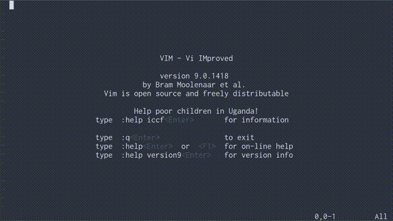

AskGPT.vim
==========

A Vim plugin that provides a ChatGPT interface.




## Requirements

- Latest Vim with `+job` and `+channel` feature.
- `curl` command.
- OpenAI API key.


## How to use

1. Install askgpt.vim plugin using your favorite plugin manager.

2. Set OpenAI API key in your vimrc.

   ``` vim
   " OpenAI API key.
   let g:askgpt_api_key = 'xxxxxxxxxxxxxxxx'
   ```

3. Open Vim and execute `:AskGPT` command to open the chat window.

4. Ask your AI assistant anything and press Enter.

Detailed documentation is in [:help askgpt.txt](./doc/askgpt.txt).


## Useful ideas

### Describe source code
1. Select a part of source code in Visual mode.
2. Run `:'<,'>AskGPT What does this function do?`
3. AI will provide a brief description.
4. Ask any question about the code, for example, `How to use it?`

### Summarize document
1. Run `:%AskGPT Summarize it`.
2. AI will provide a summary version of the whole document.

### Proofread and Enhance text
1. Select a sentence in Visual mode.
2. Run `:'<,'>AskGPT Proofread and enhance it`
3. AI will proofread and suggest improvements.
4. Ask for specific suggestions, for example, `Make it more polite`.

### Translate foreign language
1. Select a text in Visual mode.
2. Run `:'<,'>AskGPT Translate it`
3. AI will translate the text you selected.

### Convert source code
1. Run `:%AskGPT Translate it to Python`
2. AI will provide a Python version of the source code.

### Ask to pretend a role or character
1. Run `:AskGPT` to open a chat window.
2. Type `ggzo` to open the system prompt message.
3. Edit the prompt to specify a role or character.
   For example:
   - `You are a wise mentor. Help the user with useful questions.`
   - `You are a bigoted philosopher. Discuss complex ideas.`
4. Enjoy chatting with your chosen persona.
