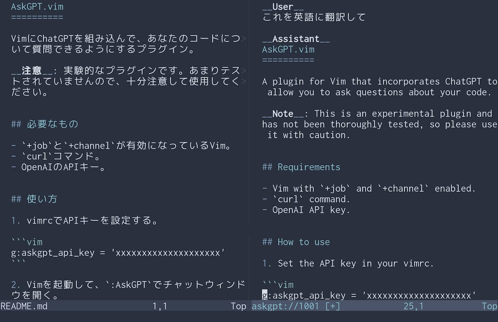

AskGPT.vim
==========

VimにChatGPTを組み込んで、あなたのコードについて質問できるようにするプラグイン。

__注意__: 実験的なプラグインです。あまりテストされていませんので、十分注意して使用してください。

English version of readme (that was translated via this plugin!), follows Japanese version.




## 必要なもの

- `+job`と`+channel`が有効になっているVim。
- `curl`コマンド。
- OpenAIのAPIキー。


## 使い方

1. vimrcでAPIキーを設定する。

```vim
g:askgpt_api_key = 'xxxxxxxxxxxxxxxxxxxx'
```

2. Vimを起動して、`:AskGPT`でチャットウィンドウを開く。

3. 聞きたいことを入力してエンターを押す。


## ヒントと注意事項

- `:AskGPT`を実行したウィンドウの内容はChatGPTに送信されますので、「この関数は何？」や「この文章を翻訳して」といった依頼をすることができます。

- OpenAIに送信されると困るファイルの上では`:AskGPT`を実行しないように注意してください。

- 元のウィンドウで開かれているファイルを全て解析するので、巨大なファイルを開いている場合はトークン量が膨大になるおそれがあります。注意して使用してください。


---

A plugin for Vim that incorporates ChatGPT to allow you to ask questions about your code.

__Note__: This is an experimental plugin and has not been thoroughly tested, so please use it with caution.


## Requirements

- Vim with `+job` and `+channel` enabled.
- `curl` command.
- OpenAI API key.


## How to use

1. Set the API key in your vimrc.

```vim
g:askgpt_api_key = 'xxxxxxxxxxxxxxxxxxxx'
```

2. Launch Vim and open the chat window with `:AskGPT`.

3. Type in what you want to ask and press enter.


## Tips and notes

- The contents of the window where `:AskGPT` is executed are sent to ChatGPT, so you can make requests such as "What is this function?" and "Translate this sentence".

- Be careful not to execute `:AskGPT` on files that should not be sent to OpenAI.

- It analyzes all files open in the original window, so if you have a large file open, the number of tokens may become enormous. Use with caution.
